# 🧠 Agentic AI Workflow: The Hybrid Architecture

> **"Stability of SDK + Intelligence of ADK"**

This document details the **Agentic AI Architecture** powering ArthAstra. We utilize a **Hybrid Approach** that combines the conceptual power of Google's **Agent Development Kit (ADK)** for structured reasoning with the production stability of the **Google GenAI SDK** for execution.

---

## 🏗️ The Hybrid Architecture

In high-stakes financial applications, "hallucinations" (AI making up facts) are unacceptable. Our hybrid architecture ensures **Determinism** (Predictable Math) and **Flexibility** (AI Reasoning).

| Component | Technology | Role |
|-----------|------------|------|
| **Brain** | Gemini 2.5 Flash | Reasoning, Strategy, and Debate |
| **Hands** | TypeScript Tools | Deterministic Calculations (EMI, DTI, Risk) |
| **Nervous System** | Google ADK / SDK | Orchestration, Handoffs, and Tool Execution |

---

## 1. The Rejection Recovery Squad (Sequential Pipeline)

This system activates when a user is **Rejected** for a loan. It acts as a specialized crisis management team.

### 🔄 Workflow Diagram


```mermaid
graph TD
    User[User Input] -->|Loan Application| Inv[🕵️ Investigator Agent]
    Inv -->|Calls Tools| Tools1[DTI & Risk Calc]
    Tools1 -->|Results| Inv
    Inv -->|Investigation Rpt| Neg[🐺 Negotiator Agent]
    Neg -->|Calls Tool| Tools2[Credit Simulator]
    Tools2 -->|Results| Neg
    Neg -->|Strategy| Arc[🏗️ Architect Agent]
    Arc -->|Calls Tool| Tools3[Savings Timeline]
    Tools3 -->|Results| Arc
    Arc -->|Recovery Plan| Final[User Dashboard]
```

### 🤖 Agent Roles & Capabilities

#### **Agent 1: The Investigator (Sherlock)**
*   **Role:** Forensic analysis of financial data.
*   **Behavior:** Skeptical, detail-oriented. Looks for "why" the bank said no.
*   **Tools Called:**
    *   `calculateDTI(income, emi)`: Checks if debt burden > 40%.
    *   `analyzeEmploymentRisk(type, tenure)`: Flags unstable job profiles.
    *   `detectFinancialAnomalies(data)`: Finds income/savings mismatches.

#### **Agent 2: The Negotiator (The Wolf)**
*   **Role:** Strategy & Defense.
*   **Behavior:** persuasive, tactical. Turns weaknesses into "mitigated risks".
*   **Tools Called:**
    *   `simulateCreditScoreImpact(score, actions)`: Predicts future CIBIL score if specific actions are taken (e.g., "Dispute Error" -> +15 pts).

#### **Agent 3: The Architect (The Builder)**
*   **Role:** Long-term planning.
*   **Behavior:** Practical, timeline-focused.
*   **Tools Called:**
    *   `calculateSavingsTimeline(current, target, monthly)`: Mathematically proves *when* the user will be ready.

---

## 2. The Financial Council (Parallel Debate System)

This system simulates a **Bank Credit Committee** to provide a balanced loan decision.

### 🔄 Workflow Diagram


```mermaid
graph TD
    Input[Loan Request] -->|Broadcast| Opt[⚡ The Optimist]
    Input -->|Broadcast| Pess[🔒 The Pessimist]
    
    subgraph "Parallel Processing"
    Opt -->|Finds Strengths| Arg1[Approval Argument]
    Pess -->|Finds Risks| Arg2[Rejection Argument]
    end
    
    Arg1 --> Judge[⚖️ The Judge]
    Arg2 --> Judge
    Judge -->|Synthesizes| Verdict[Final Decision]
```

### 🤖 Agent Roles

*   **⚡ The Optimist:** Sales-driven. Focuses on potential, growth, and good history. *("Income is stable, approve him!")*
*   **🔒 The Pessimist:** Risk-driven. Focuses on economic downturns and gaps. *("Tenure is too short, reject him!")*
*   **⚖️ The Judge:** Impartial. Weighs both arguments against regulatory guidelines to issue a verdict.

---

## 🔧 Tool Registry (The "Hands")

These tools are **not** AI. They are pure TypeScript functions. The AI *decides* when to call them, but the *execution* is mathematical logic.

| Tool Name | Input | Output | Description |
|-----------|-------|--------|-------------|
| **calculateDTI** | `income: 150000`, `emi: 30000` | `20%` | Debt-to-Income Ratio. <40% is safe. |
| **analyzeEmploymentRisk** | `type: student`, `tenure: <6m` | `Risk: Critical` | Maps job stability to bank risk matrices. |
| **simulateCreditScoreImpact** | `score: 750`, `action: pay_down` | `Projected: 780` | Simulates credit bureau algorithms. |
| **calculateSavingsTimeline** | `save: 5000/m`, `goal: 50000` | `10 Months` | Time-to-goal calculator. |

---

## 🚀 End-to-End Use Case (Real Example)

**Scenario:** A Student earning ₹1.5 Lakh/month (Freelance) applies for a loan and is **Rejected**.

### **Step 1: Input**
```json
{
  "monthlyIncome": 150000,
  "employmentType": "student",
  "employmentTenure": "<6_months",
  "creditScore": 720
}
```

### **Step 2: The Agentic Pipeline (Live Logs)**

**1. Investigator Analysis**
> *Calls `analyzeEmploymentRisk`...*
> **Result:** "Critical Risk. Student status + Low tenure = Unstable Income."
> **Insight:** "Bank rejected not because of money, but because of STABILITY."

**2. Negotiator Strategy**
> *Calls `simulateCreditScoreImpact`...*
> **Result:** "If user registers business -> Score +0, but Credibility +50."
> **Strategy:** "Don't position as Student. Position as Proprietor."

**3. Architect Plan**
> *Calls `calculateSavingsTimeline`...*
> **Result:** "Need 6 months of bank statements to prove stability."
> **Plan:** "Wait 6 months, build statement history, re-apply as Business Owner."

### **Step 3: Final Output (User Dashboard)**
*   **Status:** 🔴 Rejected (Recovery Mode)
*   **Root Cause:** "Income Unverifiability" (Not lack of income!)
*   **Strategy:** "The Proprietor Pivot"
*   **Action Plan:**
    1.  Register as Sole Proprietorship (Week 1)
    2.  Route all freelance income through current account (Months 1-6)
    3.  Re-apply with IT Returns (Month 7)

---

## ✅ Why This Wins Hackathons

1.  **It's NOT a wrapper:** We aren't just sending text to ChatGPT. We are orchestrating a complex flow.
2.  **Tools are Real:** The logic is grounded in math, not hallucinations.
3.  **Multi-Agent Coordination:** Agents talk to each other (Investigator -> Negotiator -> Architect).
4.  **Google Stack:** Fully built on Vertex AI / Gemini ecosystem.
