# ArthAstra Finance 🚀
*> The Intelligent, Voice-First Financial Companion*

**ArthAstra** (meaning "Finance Weapon/Tool" in Sanskrit) is a next-generation financial platform designed to transform how Indians interact with credit. It moves beyond the standard "fill form -> get call" model to a **"Self-Driving Finance"** experience, powered by Google's Agent Development Kit (ADK) and Vertex AI.

---

## 🏆 Executive Verdict

ArthAstra is not just a loan aggregator; it is an **Intelligent Financial Companion**. The combination of **Voice Accessibility**, **Agentic AI Guidance**, and **Financial Planning Tools** places this product in the top 1% of fintech UX.

### 1. The Core Experience 🏠
*Foundational features that manage the loan lifecycle.*

| Feature | Status | What makes it special? |
| :--- | :--- | :--- |
| **Smart Onboarding** | ⭐ Gold Standard | It’s not just a form; it learns. Saves progress locally and adapts questions dynamically (e.g., conditional co-borrower logic). |
| **Pulse Timeline** | ✅ Live & Dynamic | Pulses to show activity. Gives "Estimated Completion Dates" to reduce user anxiety about the "black box" process. |
| **Secure Vault** | 🔒 Premium Security | Visual verification status for documents. Treats user data with the visual respect it deserves. |
| **AI Loan Matching** | 🤖 Algorithmic | Recommends loans based on approval odds, not just interest rates. |

### 2. Financial Intelligence Tools 🧠
*Advanced tools that help users make better decisions.*

| Feature | Status | What makes it special? |
| :--- | :--- | :--- |
| **Credit Optimizer** | 🚀 Innovative | A "What-If" simulator. "If I pay off ₹20k debt, my chances go up 15%." Turns rejection into a roadmap. |
| **Multi-Goal Planner** | 🎯 Strategic | Recognizes users have multiple dreams (Home + Car). Suggests optimal loan sequencing. |
| **Eligibility Reports** | 📊 Detailed | Breakdowns reason for eligibility ("Income: Pass, Credit Score: Warning") rather than a simple Yes/No. |

### 3. Trust & Retention Engines 🛡️
*Features designed to keep users engaged even if they face rejection.*

| Feature | Status | What makes it special? |
| :--- | :--- | :--- |
| **Rejection Recovery** | 🩺 The "Doctor" | Diagnoses the rejection (e.g., "High DTI") and triggers the **ADK Recovery Squad** to fix it. |
| **Peer Insights** | 👥 Social Proof | "Better than 78% of applicants like you." Gamifies financial health. |
| **Testimonials** | 📖 Relatable | Dynamic stories matching the user's profile (e.g., Freelancer sees Freelancer success stories). |

### 4. The "X-Factor": Accessibility 🗣️
*Killer features for the Indian market.*

| Feature | Status | What makes it special? |
| :--- | :--- | :--- |
| **Bilingual Voice AI** | 🎙️ Game Changer | Users can speak answers in Hindi/English. Understands "5 Lakh" and "Pachaas Hazaar" natively. |
| **Voice Navigation** | 🧭 Hands-Free | "Check my eligibility" navigates the app. Feels like a conversation with a banker. |
| **Contextual Chatbot** | 💬 Smart | Knows your income context. Doesn't ask redundant questions. |

---
## 🔐 Local-First Architecture (Privacy & Scope)

In the current hackathon version, ArthAstra uses a **"Local-First" Architecture** powered by Browser LocalStorage.

### 🔧 Technical Details
*   **User Data**: All sensitive financial info (Income, EMI, etc.) is saved as a JSON string directly in the user's browser `window.localStorage`.
*   **Session**: Login state is managed locally.
*   **Documents**: We simulate the "Secure Vault" by referencing file metadata locally.

### 💡 Why this is a "Feature" (Not a bug)
1.  **Privacy 🛡️**: This acts as a **"Zero-Knowledge Privacy Feature"**. No financial data is ever saved to our servers; it stays on the user's device. We only process it ephemerally for the AI Council.
2.  **Speed ⚡**: Instant load times with no database latency.
3.  **Hackathon Scope**: It simplifies deployment (no database setup required) while perfectly demonstrating the functionality.

---


## 👨‍💻 Technical Summary

*   **Architecture**: Local-First Hybrid (Fast UX + Server Sync).
*   **Aesthetic**: "Glassmorphism" gradients + Tailwind CSS (Premium Feel).
*   **Stack**: Next.js 15, React Server Components, Framer Motion, **Google ADK**, **Vertex AI**.

---

## 🏗️ Project Structure

We separate AI logic (`lib/agents`, `lib/tools`) from the frontend UI (`app`, `components`).

### 📂 Core Directories

| Directory | Description |
| :--- | :--- |
| **`lib/agents/`** | **The Brain.** Contains the Google ADK Agent definitions. |
| ├── `adk-recovery-squad.ts` | The 3-agent pipeline (Investigator -> Negotiator -> Architect). |
| ├── `adk-council.ts` | The Multi-Agent Debate System (Optimist vs Pessimist -> Judge). |
| **`lib/tools/`** | **The Hands.** Functional tools used by agents. |
| ├── `eligibility-calculator.ts` | Calculates DTI, LTV, and credit health. |
| ├── `credit-simulator.ts` | Simulates credit score improvements. |
| ├── `agent-tools.ts` | Type-safe wrappers for tools using Zod schemas. |
| **`lib/ai/`** | **The Eyes.** Vision and RAG modules. |
| ├── `doc-vision.ts` | Uses `gemini-2.5-flash` for forensic document verification. |
| **`app/api/`** | **The Interface.** Next.js API Routes connecting UI to Agents. |
| ├── `rejection-recovery/` | Trigger point for the Recovery Squad pipeline. |
| ├── `council-meeting/` | Trigger point for the Financial Council debate. |
| ├── `verify-document/` | Endpoint for document upload and analysis. |

---

## 🧠 The 4 Levels of ArthAstra Intelligence

ArthAstra uses a **4-Layer Cognitive Architecture** to process financial decisions.

### Level 1: Perception & Knowledge (Vision + RAG)
*The system "Sees" documents and "Knows" rules.*
*   **👁️ Forensic Vision**: Uses `gemini-2.5-flash` to verify documents, detecting blurs, edits, and extracting data (Name/ID).
*   **📚 RAG Brain**: Uses `text-embedding-004` to retrieve context from a specialized knowledge base (RBI guidelines, Tax rules) so answers are factually grounded.

### Level 2: Analytic Reasoning (The Investigator)
*The "Sherlock Holmes" of Finance.*
*   **Role**: Analyzes the raw data (Income, EMI, Tenure).
*   **Action**: Calls deterministic tools (`calculateDTI`, `analyzeEmploymentRisk`) to separate "Bad Data" from "Bad Luck".
*   **Result**: Produces a forensic investigation report.

### Level 3: Strategic Planning (The Negotiator & Architect)
*The "Strategy Team".*
*   **The Negotiator**: Takes the investigation findings and "spins" them. If tenure is low, emphasizes income stability.
*   **The Architect**: Builds the concrete roadmap. "Save ₹5k/month for 6 months -> Score hits 750 -> Apply."
*   **Result**: A 3-step action plan (JSON Output).

### Level 4: Adversarial Judgment (The Financial Council)
*The "Supreme Court".*
*   A **Parallel Debate System** that simulates real-world loan committees.
    1.  **⚡ The Optimist**: Argues for approval based on "Potential".
    2.  **🔒 The Pessimist**: Argues for rejection based on "Risk".
    3.  **⚖️ The Judge**: Weighs both arguments against regulatory limits and issues a binding, biased-free verdict.

> **Why this matters**: Most AI just "chats". ArthAstra **Perceives, Analyzes, Plans, and Judges.**

---

### 🧬 System Architecture Diagrams

**1. The Recovery Squad (Levels 2 & 3)**

```mermaid
graph TD
    User[User Input] -->|Data| Level2[🕵️ Investigator]
    Level2 -->|Analysis| Level3a[🐺 Negotiator]
    Level3a -->|Strategy| Level3b[🏗️ Architect]
    Level3b -->|Plan| Final[User Dashboard]
```


**2. The Financial Council (Level 4)**

```mermaid
graph TD
    Input[Loan Request] -->|Broadcast| Opt[⚡ Optimist]
    Input -->|Broadcast| Pess[🔒 Pessimist]
    Opt -->|Argue| Judge[⚖️ The Judge]
    Pess -->|Argue| Judge
    Judge -->|Verdict| Decision[Final Output]
```


---

## 🚀 Google Cloud Deployment Guide

We are designed for **Google Cloud Run**.

### 1. Enable APIs
```bash
gcloud services enable run.googleapis.com artifactregistry.googleapis.com cloudbuild.googleapis.com
```

### 2. Build Container
```bash
gcloud builds submit --tag gcr.io/[PROJECT_ID]/arth-astra-v2
```

### 3. Deploy
```bash
gcloud run deploy arth-astra-live \
  --image gcr.io/[PROJECT_ID]/arth-astra-v2 \
  --platform managed \
  --allow-unauthenticated \
  --set-env-vars GOOGLE_GENERATIVE_AI_API_KEY="[YOUR_KEY]"
```

---

## 🛠️ Local Development

1.  **Clone & Install**:
    ```bash
    git clone https://github.com/your-repo/arth-astra.git
    npm install
    ```
2.  **Environment**:
    Create `.env.local`:
    ```env
    GOOGLE_GENERATIVE_AI_API_KEY=your_gemini_key
    ```
3.  **Run**:
    ```bash
    npm run dev
    ```

---

*> Built with ❤️ for the Google GenAI Hackathon.*
