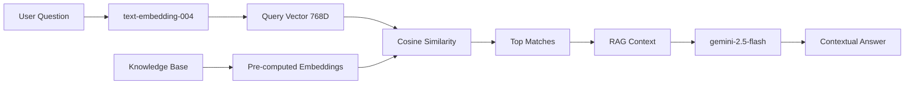

# 🧠 AI/ML Models Architecture

## Google NLP & Vision Models Implementation

ArthAstra uses **production-grade** Google AI models for enterprise intelligence.

---

## 1. 📊 RAG (Retrieval-Augmented Generation)

### Model: `text-embedding-004`
- **Type**: NLP Embedding Model (768-dimensional vectors)
- **Purpose**: Convert text into semantic vectors for intelligent search

### Architecture:


### Files:
| File | Purpose |
|------|---------|
| `lib/knowledge/company-brain.ts` | 10-entry knowledge base |
| `lib/ai/embeddings.ts` | Vector generation |
| `lib/ai/vector-store.ts` | Semantic search |
| `app/api/chat/route.ts` | RAG integration |

---

## 2. 👁️ Document Verification (Vision)

### Model: `gemini-2.5-flash`
- **Type**: Multimodal Vision-Language Model
- **Capabilities**: Image analysis, OCR, fraud detection, pixel forensics

### Verification Process:
```mermaid
graph TD
    Upload[User Uploads Document] --> API[/api/verify-document]
    API --> Vision[gemini-2.5-flash]
    Vision --> Checks{Forensic Checks}
    Checks -->|Format| Valid1[Pattern Match]
    Checks -->|Quality| Valid2[Blur Detection]
    Checks -->|Authenticity| Valid3[Edit Detection]
    Checks -->|Extraction| Data[Extract Name/Number]
    Valid1 & Valid2 & Valid3 & Data --> Result{Verdict}
    Result -->|Pass| Approve[✅ Verified]
    Result -->|Fail| Reject[❌ Issues Found]
```

### Supported Documents:
| Type | Validation |
|------|------------|
| PAN Card | Format (ABCDE1234F), blur, editing |
| Aadhaar | Masked digits, UIDAI watermarks |
| Salary Slip | Letterhead, components, recency |
| Bank Statement | Official format, transactions |

### Files:
| File | Purpose |
|------|---------|
| `lib/ai/doc-vision.ts` | Vision verification logic |
| `app/api/verify-document/route.ts` | API endpoint |

---

## 3. 🤖 Agentic AI (Chat & Recovery)

### Model: `gemini-2.5-flash`
- **Used By**: All agents (Orchestrator, Loan Officer, Recovery, Council)
- **Pattern**: Sequential Pipeline + Parallel Debate

### Files:
| File | Purpose |
|------|---------|
| `lib/agents/core/base-agent.ts` | Agent base class |
| `lib/agents/core/orchestrator.ts` | Intent routing |
| `app/api/chat/route.ts` | Chat endpoint |
| `app/api/council-meeting/route.ts` | Financial Council |

---

## Summary

| Feature | Model | Status |
|---------|-------|--------|
| RAG Embeddings | `text-embedding-004` | ✅ Live |
| Document Vision | `gemini-2.5-flash` | ✅ Live |
| Agentic Chat | `gemini-2.5-flash` | ✅ Live |
| Financial Council | `gemini-2.5-flash` | ✅ Live |

> **Architecture**: Google GenAI SDK → Gemini API (Cloud-hosted inference)
