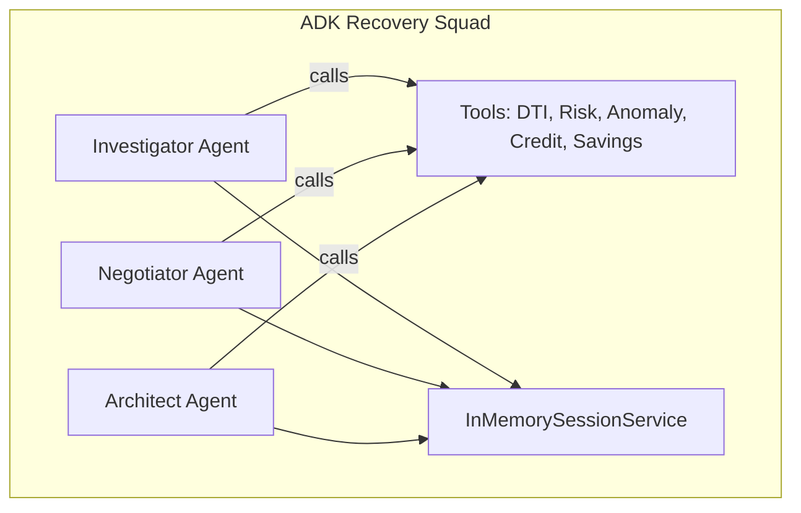

# Google Agent Development Kit (ADK) - Full Integration

## All 4 Levels Implemented ✅

| Level | Feature | Status |
|-------|---------|--------|
| 1 | Agent Configuration | ✅ `LlmAgent` class |
| 2 | Agent Execution | ✅ `Runner.run()` |
| 3 | Tool Calling | ✅ 5 functions |
| 4 | Memory/Planning | ✅ `InMemorySessionService` |

---

## Architecture



---

## Implementation Code

```typescript
import { LlmAgent, Runner, InMemorySessionService } from "@google/adk";

// Session Memory (Level 4)
const sessionService = new InMemorySessionService();

// Tool Definition (Level 3)
const dtiTool = {
    name: "calculateDTI",
    description: "Calculate Debt-to-Income ratio",
    parameters: { ... },
    function: (args) => calculateDTI(...)
};

// Agent Config (Level 1)
const investigatorAgent = new LlmAgent({
    name: "investigator",
    model: "gemini-2.5-flash",
    instruction: "Analyze loan applications...",
    tools: [dtiTool, riskTool, anomalyTool],
});

// Agent Execution (Level 2)
const runner = new Runner({
    agent: investigatorAgent,
    sessionService,
});

const events = runner.run({
    userId: "user-1",
    sessionId: "session-123",
    newMessage: { role: "user", parts: [{ text: input }] },
});

for await (const event of events) {
    console.log(event.content);
}
```

---

## Files

| File | Contents |
|------|----------|
| `lib/agents/adk-recovery-squad.ts` | 3 agents, 5 tools, Runner |
| `lib/agents/adk-council.ts` | 3 debate agents, parallel execution |
